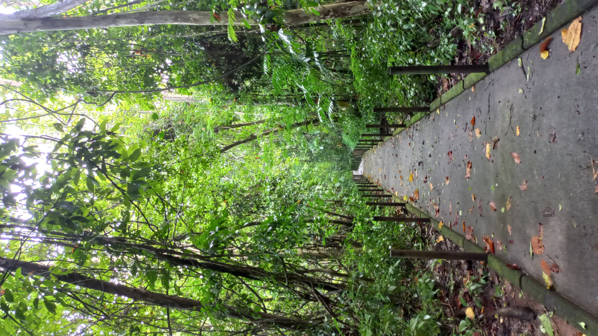
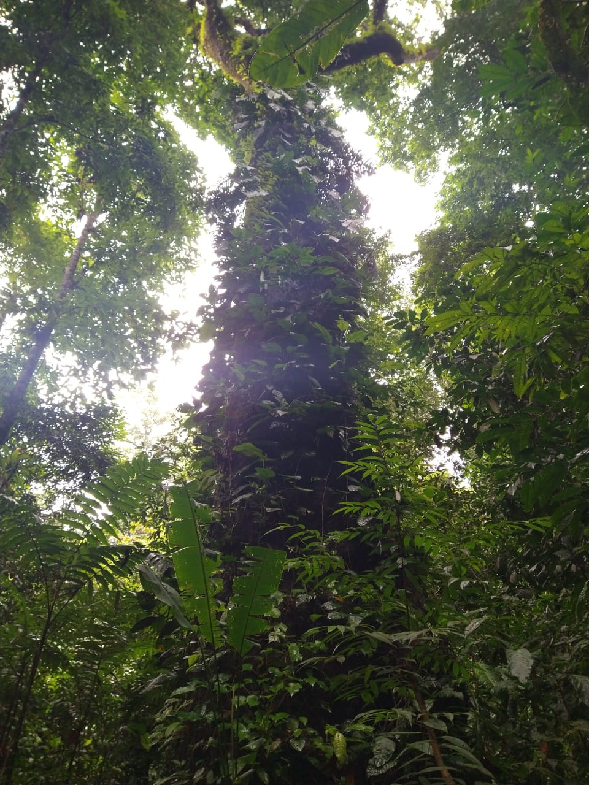
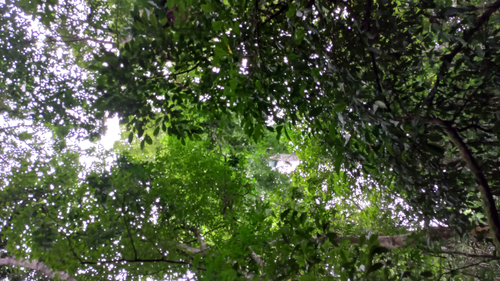
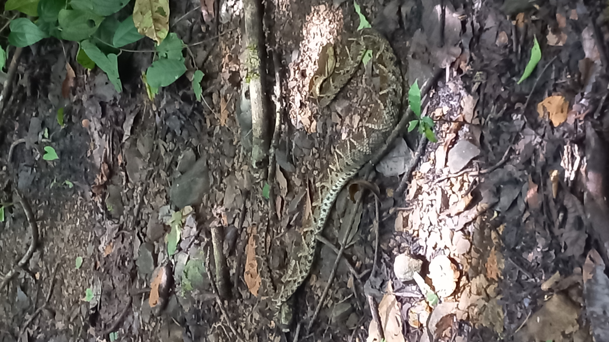
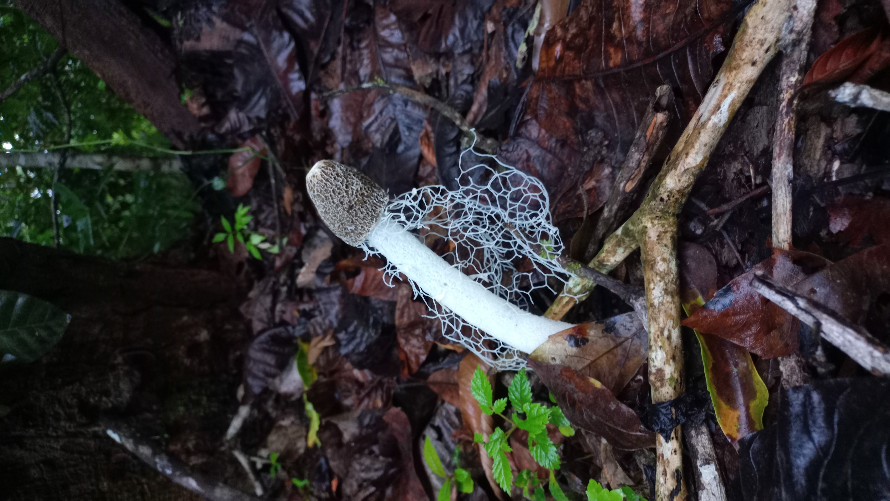
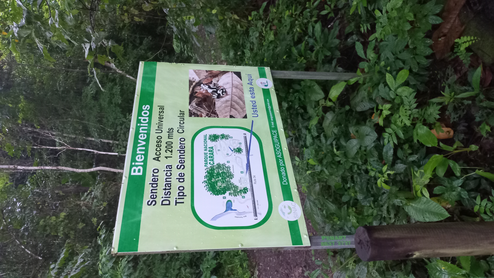

# Parque Nacional Carara  

Inició como Reserva Biológica en 1978 mediante el Decreto Ejecutivo № 8491-A. Posteriormente, después de veinte años cambió su categoría de manejo a Parque Nacional a través del Decreto Ejecutivo № 27411-MINAE ([SINAC](https://www.sinac.go.cr/ES/ac/acopac/pnc/Paginas/default.aspx), s.f).   
    
Fuente: Elaboración propia.  

#### **Ubicación**      
  Se ubica a 90 kilómetros de San José. Su entrada principal se localiza  2 kilómetros al Sur del puente Río Grande de Tárcoles. El parque está dentro de los cantones de [Turrubares](https://es.wikipedia.org/wiki/Cant%C3%B3n_de_Turrubares) y [Garabito](https://es.wikipedia.org/wiki/Cant%C3%B3n_de_Garabito).

#### **Curiosidades**
-Lo que hoy en día es el parque originalmente constituía la Gran [Hacienda Coyolar](https://cambiopolitico.com/antigua-casona-de-la-hacienda-el-coyolar/86731/), una de las concentraciones de tierra de propiedad privada más grandes que ha tenido Costa Rica.  
-La palabrara _Carara_  en lengua indígena Huetar significa “Río de lagartos”.  
-Primer parque nacional en contar con un sendero de acceso universal.  
-Único bosque de transición del Pacífico Central, convergen especies propias de los bosques seco y húmedo.  
-Es uno de los principales sitios en el país para la observación de aves o birdwatching.

#### **Horario**
De mayo a noviembre, todos los días de 8 am a 4 pm.  
De diciembre a abril, todos los días de 7 am a 4 pm

### Senderos  
1.*Sendero de Acceso Universal*: **1.2 km** de recorrido, cuenta con 9 bahias de descanso, sistema de agua potable en todo el trayecto y una batería sanitaria adaptada según los requerimientos de la ley 7600.   
2.*Sendero Araceas*: Se caracteriza por ser sendero circular de aproximadamente **1200** metros de largo.  
3.*Sendero Laguna Meándrica*: Sendero lineal un poco más largo de **2000** metros. Su nombre se relaciona al meandro formado en el río Tárcoles con una laguna que se forma en ese sector de aproximadamente 600 metros de longitud y 40 metros de ancho.   
4.*Sendero Quebrada Bonita*: **1300** metros, su principal actractivo es la quebrada que le da el nombre a el sendero.  
5.*Sendero Encuentro de Ecosistemas*: Es un sendero lineal de **650** metros que conecta sendero Quebrada Bonita y el Sendero de Acceso universal.   

#### Flora y fauna:
Según datos científicos, presenta los siguientes registros:
• 480 especies de plantas entre árboles y arbustos, siendo 14 especies endémicas y 29 especies consideradas raras y endémicas.  
• 124 especies de reptiles, es decir el 53% de las especies de reptiles en Costa Rica (234).  
• 112 especies de mamíferos, siendo el 47.8% del total de estas especies en el país (237).  
• 62 especies de anfibios, es decir el 32.8% de las 189 especies de anfibios de Costa Rica.  
• 420 especies de aves, 47% de las 893 especies reportadas en el país, considerado como uno de los sitios más importantes en CR para la observación de aves en su estado natural.  

#### Arqueología

El Parque cuenta con numerosos vestigios de ocupaciones indígenas precolombinos. Los estudios arqueológicos realizados han permitido la ubicación hasta el momento de quince sitios arqueológicos que corresponden a dos épocas de ocupación: La Fase Pavas (300 años a.C. – 300 años d.C.) y la Fase Cartago (800 años – 1500 años d.C.), con agricultura como base de subsistencia( [Sitio Arqueológico Carara](http://origenes.museocostarica.go.cr/detalleBusqueda.aspx?id_sitio=8217) ).
 
#### Amenazas

Los incendios forestales, [la cacería furtiva](http://www.pequenasdonacionescr.org/sites/default/files/documentos/informempd-analisis_de_la_caceria_en_carara-agosto2013.pdf)
 y la limitación en cuanto a recursos financieros y humanos para hacer frente a la creciente demanda turística por los atractivos que protege el parque, son los principales problemas que se enfrentan. 

#### Galería
     
   
 
### Referencias
 [SINAC](https://www.sinac.go.cr/ES/ac/acopac/pnc/Paginas/default.aspx)  
 [Más información](https://areasyparques.com/areasprotegidas/parque-nacional-carara/)  
 [Más información](https://costa-rica-guide.com/nature/national-parks/carara/)  

